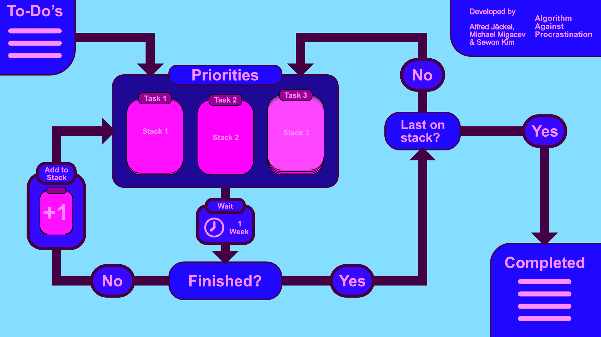

# CodingIxD_DoDot

## Conceptual

The projects main goal is to help people who procrastinate with an emphasis on goals without deadlines. 

For that we have singled out problem points:
Forgetting
Difficulty Starting
Big Plans
Too Many Tasks

To combat these we have done many tests and surveys to develop an algorithm which helps people to procrastinate less.

We prioritize up to 3 tasks. For each task added a timer of 1 week starts. After the timer ends we ask if the ask has been successful. 
If the task has failed the we add a checkpoint/step on the stack. It is important to notice that to reach the checkpoint should be easier than to complete the whole task. The Timer restarts. That means by "failing" the task every week we recursively start building a stack of ever easier getting checkpoints. 
If the task has been successful we ask if it is the last item on the stack leave it in the priorities accordingly. If the stack is empty we have completed the task.

## Technical

We have a Flask based webapplication.
On the WebApp we have 3 lists.

Completed:
  - this is where all your completed tasks go

ToDo:
  - this is a place for all the ToDos
  
Priorities:
  - Here you can have up to 3 tasks
  - Each has a timer written in .js 
    - The timer is connected to an animation which shows how far the clock is
    - The timer prompts us with a question after it runs out
    - The prompt then adds the new step on the stack and restarts the timer
    
You can always finish an Item or Edit it even if it is not Prioritized.

PLEASE IMAGE OF THE APP HERE

## Physical

For implementing our idea we have a physical device. The device has 3 "caterpillars" hanging from it and a fan that resembles a butterfly.

The fan and one caterpillar are equipped with a stepper motor each. Because of our budget and time limitations only one caterpillar is powered by a motor.
The movements of the caterpillars are correspondend to the weekly timer of the prioritized tasks. The Butterfly activates with the completion of any task or step.

The Flask based WebApplication as well as the steppermotors are powered by one Raspberry Pi Zero. 
  
  
PLEASE IMAGE OF DEVICE HERE.
    
    
## Footnotes

This code was developed for a university project with Alfred Jäckel & Michael Migacev from FU Berlin in collaboration with Sewon Kim from KHB Weißensee.

Our project was featured on:  
The Homepage - https://www.codingixd.org/lets-get-physical/  
https://www.art-in-berlin.de/ausstellungs-text.php?id=12320  
https://citylab-berlin.org/de/events/lets-get-physical/  
https://citylab-berlin.org/de/events/die-labissage-2/  
https://www.matters-of-activity.de/de/activities/10114/let-s-get-physical  
https://kh-berlin.de/kalender/665  

Although almost none of it is left anymore we have found https://github.com/GRitchie1/Balena_ToDoList to be a very helpful starting point for our project.
